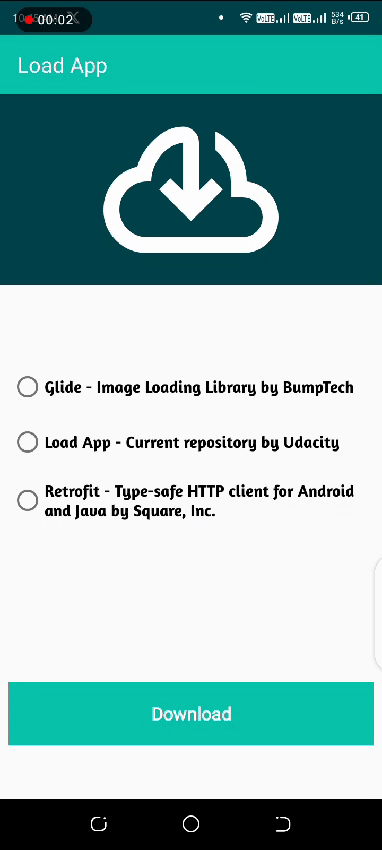
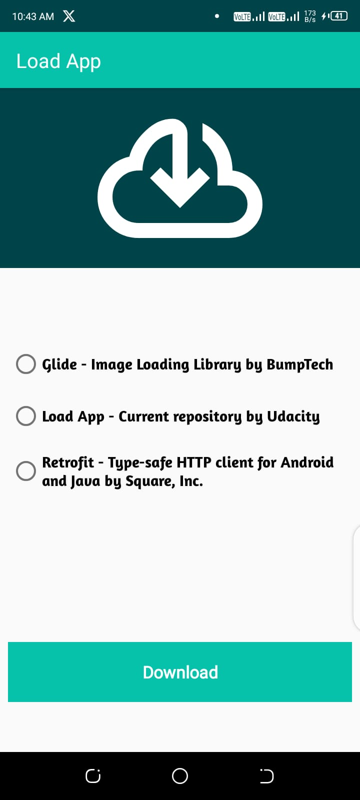
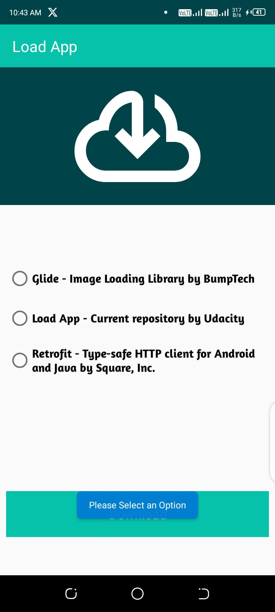
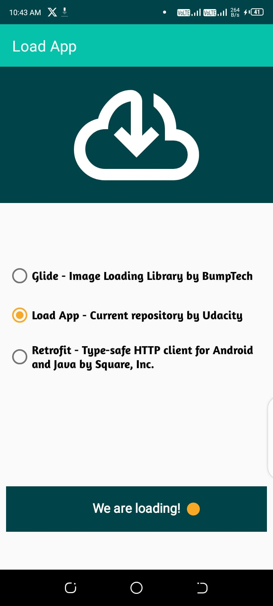
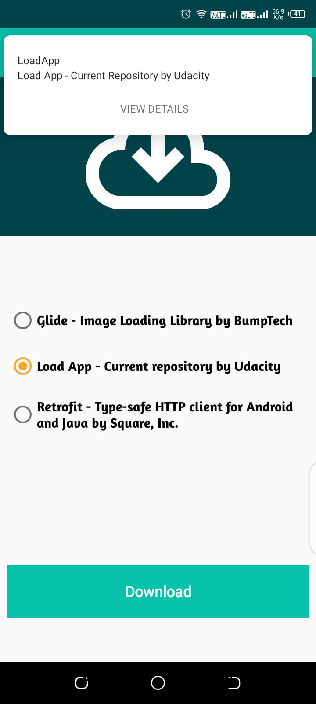

# Load-App
Project 3: Android Kotlin Developer Udacity | Nanodegree
### Rationale
> The App is inspired by The [Android Kotlin Developer Nanodegree Course](https://www.udacity.com/enrollment/nd940/2.0.9) on Udacity.
> It's the [third](https://learn.udacity.com/nanodegrees/nd940/parts/cd0637/lessons/ae84b65a-7a50-4e82-a06d-443498993548/concepts/6dea0c0b-5200-4809-a2d2-d111f8b9a950) of the Five projects in the course.

### Built With
* [Kotlin](https://kotlinlang.org/)
* [View Binding](https://developer.android.com/topic/libraries/data-binding) - a support library that allows you to bind UI components in your layouts to data sources in your app using a declarative format rather than programmatically.
* [Custom Views](https://developer.android.com/develop/ui/views/layout/custom-views/custom-components)
* [MotionLayout](https://developer.android.com/develop/ui/views/animations/motionlayout) - is a layout type that helps you manage motion and widget animation in your app
* [NotificationManager](https://developer.android.com/reference/android/app/NotificationManager)
* [Notifications](https://developer.android.com/develop/ui/views/notifications/build-notification)
* [DownloadManager](https://developer.android.com/develop/ui/views/notifications/build-notification)

### Screenshots
|  |  |  |
|:-------------------------------------------:|:-----------------------------------------:|:-----------------------------------------:|
|    |  |